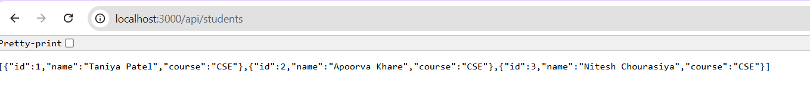

🚀 Day 05 – Express.js Basics

This project demonstrates the basics of Express.js by building a simple server that serves a static UI and provides a REST API for managing student data.

📂Project Structure

Day-05/
│── public/ → Frontend files
│ ├── index.html
│ ├── style.css
│ └── script.js
│
│── server.js → Express.js server
│── package.json → Project metadata & dependencies
│── package-lock.json → Dependency lock file
│── .gitignore → Ignored files (node_modules, lock files, etc.)

⚙️ Features

-Serves static frontend from the public/ folder
-Provides a REST API to manage students
-GET /api/students → Returns list of students
-POST /api/students → Adds a new student
-Handles errors for duplicate IDs or missing fields
-SPA-friendly: always serves index.html for unknown routes

🛠️ Tech Stack

-Node.js
-Express.js
-HTML, CSS, JavaScript (for the frontend)

🚀 Getting Started

Step 1: Install Dependencies
npm install

Step 2: Run the Server
node server.js

By default, the server runs at:
http://localhost:3000

