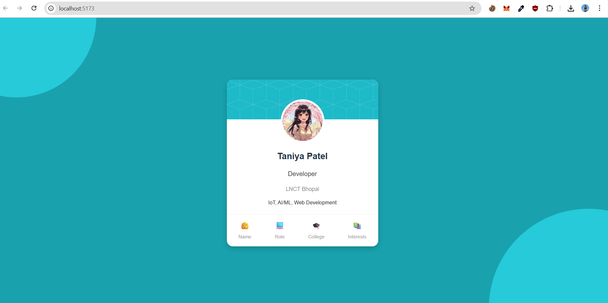

# 🚀 Day-06: Profile Card Component (React + Vite)

This project is a **Profile Card Component** built using **React (with Vite)**.
It displays user information such as **Name, Role, College, and Interests**, with a modern card UI similar to the design reference provided.

---

## 🛠️ Technologies Used

- ⚡ **Vite** – Fast React development environment
- ⚛️ **React** – Component-based UI
- 🎨 **CSS3** – Styling for the Profile Card
- 📦 **npm** – Dependency management

---

## ✨ Features

- 📍 Centered profile card (full desktop view)
- 🎨 Stylish card design with:
  - Cover background
  - Profile image
  - Information section
  - Footer with emoji labels
- 🖼️ Decorative teal background circles (matching the reference UI)

---

## 🚀 Getting Started

### 1.Clone the repository
```bash
git clone <your-repo-link>
cd Day-06
```
### 2.Install dependencies
```bash
npm install
```
### 3.Run the development server
```bash
npm run dev
```
📸 Screenshot (UI Reference)
The Profile Card UI matches the design below 👇


