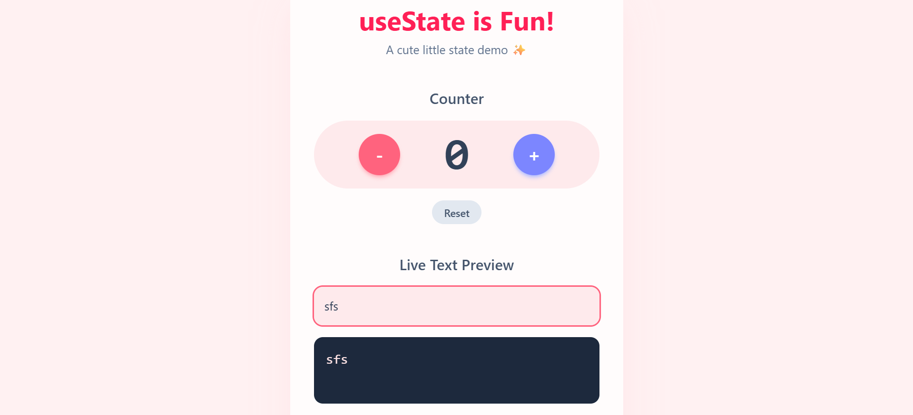

# Day-07 — State Management (React useState)

This is a simple React project demonstrating **state management with `useState`**.  
It includes two mini tasks:

1. **Counter** — Increment, decrement, and reset with little animations.

2. **Live Text Preview** — Type and instantly see your text preview update.

---

## 🚀 Features
- Counter with animated number updates.
- Buttons with hover/press animations.
- Textarea input that updates live preview.
- Word and character count.

---

## 📂 Project Structure

Day-07/
├── index.html # Entry point
├── styles.css # Styling and animations
├── app.js # React components
└── README.md # Project documentation

---

## 🛠️ Setup & Usage

### Option 1 — Run with Live Server
1. Clone or download this folder.
2. Open `index.html` in VS Code.
3. Right-click → **Open with Live Server**.
4. Visit `http://127.0.0.1:5500/Day-07/index.html`.

### Option 2 — Open in Browser
- Simply double-click `index.html` and it should open in your browser.
- (Animations and state management will work using React + Babel from CDN).

---

## ⚡ Tech Stack
- **React 18** (via CDN)
- **Babel** (in-browser JSX transformer)
- **Vanilla CSS** for styling

---

## 📝 Notes
- This project uses the in-browser Babel transformer (not recommended for production).  
- For real projects, use a bundler like **Vite** or **Create React App**.

