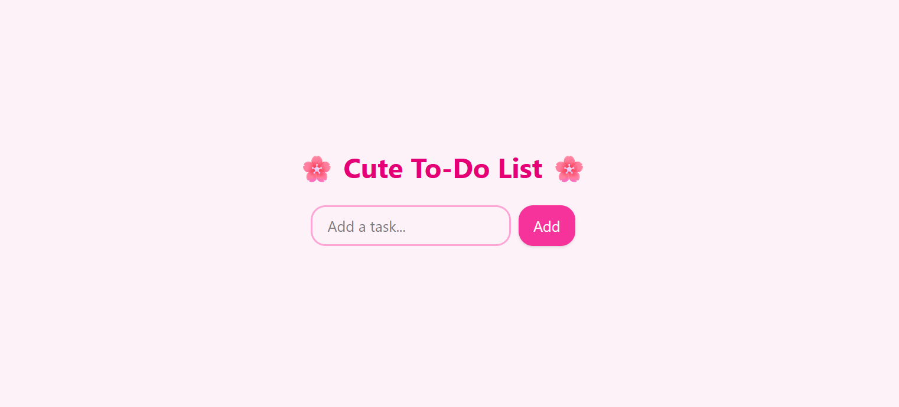

 🌸 Cute To-Do List 🌸

A simple and adorable To-Do List app built with React.
This project demonstrates:

* Rendering lists with `.map`
* Handling events (`onClick`, `onChange`)
* Managing local state with `useState`
* A cute pastel UI styled with TailwindCSS ✨

---

## 🚀 Features

* ➕ Add tasks
* ✅ Toggle tasks as complete/incomplete
* 🎀 Cute, minimal, responsive design

---

## 🗂️ File Structure

```
cute-todo/
 ├── src/
 │   ├── components/
 │   │   ├── TodoApp.jsx
 │   │   ├── TodoInput.jsx
 │   │   └── TodoList.jsx
 │   ├── App.jsx
 │   ├── index.css
 │   └── main.jsx
 ├── package.json
 └── vite.config.js
```

---

## ⚡ Installation & Setup

1. Clone the repo:

   ```bash
   git clone https://github.com/yourusername/cute-todo.git
   cd cute-todo
   ```

2. Install dependencies:

   ```bash
   npm install
   ```

3. Run development server:

   ```bash
   npm run dev
   ```

4. Open in your browser:

   ```
   http://localhost:5173
   ```

---

## 🛠️ Built With

* [React](https://react.dev/) – UI library
* [TailwindCSS](https://tailwindcss.com/) – Styling
* [Vite](https://vitejs.dev/) – Fast bundler

---

## 📸 Preview



---

## 🎯 Learning Goals

* Practice **list rendering** in React with `.map`
* Learn **event handling** (`onClick`, `onChange`)
* Understand **local state management**

---

## 🌟 Future Improvements

* 🎨 Add Framer Motion animations
* 💾 Save tasks in localStorage
* 📱 Improve mobile responsiveness

