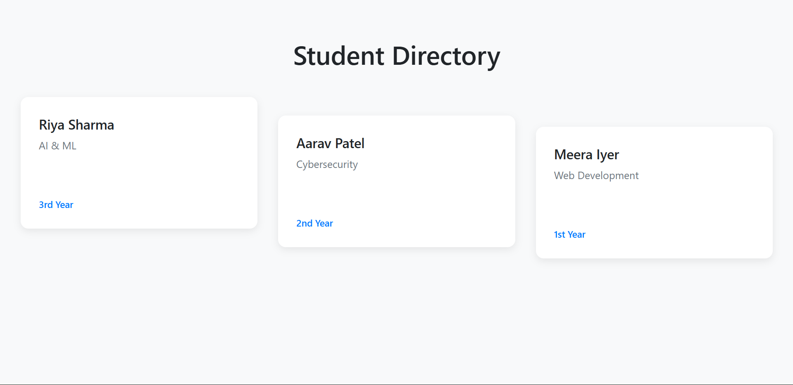

⚡ Student Directory (React + Node)

A minimal Student Directory web app with a Node.js backend and React frontend.
It fetches student data from an API using useEffect and fetch, then displays them in a clean futuristic UI with smooth GSAP animations.

---

## 🚀 Features

* Backend: Node.js + Express API serving student data
* Frontend: React (Vite) + GSAP animations
* Responsive Grid Layout: Cards align perfectly across all screen sizes
* Animations: Smooth entry + hover glow effects

---

## 📂 Project Structure

```
student-directory/
│
├── backend/
│   ├── server.js        # Express server
│   └── students.json    # Sample student data
│
├── frontend/
│   ├── src/
│   │   ├── App.jsx      # Main React app
│   │   ├── StudentCard.jsx
│   │   ├── index.css   
│   │   └── main.jsx
│   └── index.html
│
└── README.md
```

---

## 🔧 Setup Instructions

### 1️⃣ Backend (Node.js)

```bash
cd backend
npm init -y
npm install express cors
node server.js
```

API runs on:
[http://localhost:5000/api/students](http://localhost:5000/api/students)

---

### 2️⃣ Frontend (React + Vite)

```bash
cd frontend
npm create vite@latest
npm install
npm install gsap
npm run dev
```

Frontend runs on:
[http://localhost:5173/](http://localhost:5173/)

---

## 📸 Demo Screenshots



---

## 🛠️ Tech Stack

* Frontend: React, Vite, GSAP
* Backend: Node.js, Express
* Styling: CSS (dark theme + grid layout)

---

## ✨ Future Improvements

* Add search & filter for students
* Connect with a real database (MongoDB / PostgreSQL)
* Add authentication for admins
* Add animations on page transitions

---
