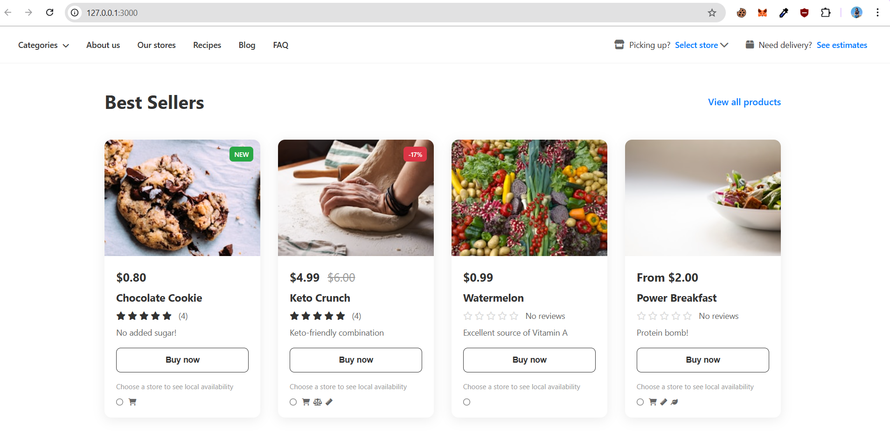

# Day-10: Styled Product Card List

A modern, responsive e-commerce product card list built with HTML, CSS, and JavaScript.

## 🎯 Project Overview

This project recreates a clean, modern e-commerce webpage featuring a "Best Sellers" section with four interactive product cards. The design emphasizes minimalism, clean typography, and smooth user interactions.



## ✨ Features

### 🎨 Visual Design
- **Clean, Modern Interface**: White background with subtle shadows and clean typography
- **Responsive Grid Layout**: 4-column grid that adapts to different screen sizes
- **Product Cards**: Elevated cards with hover effects and smooth transitions
- **Professional Typography**: System fonts for optimal readability

### 🛍️ Product Cards
- **Product Images**: High-quality images with hover zoom effects
- **Price Display**: Clear pricing with discount support (original vs. current price)
- **Rating System**: Star ratings with review counts
- **Product Tags**: "NEW" and discount percentage tags
- **Buy Buttons**: Interactive buttons with hover states and click feedback

### 🏪 Store Integration
- **Store Selection**: Radio buttons for local store availability
- **Availability Icons**: Relevant icons for each product (shopping cart, scale, ruler, leaf)
- **Interactive Feedback**: Visual confirmation when stores are selected

### 📱 Responsive Design
- **Mobile-First Approach**: Optimized for all device sizes
- **Flexible Grid**: Adapts from 4 columns to 1 column based on screen width
- **Touch-Friendly**: Optimized for mobile interactions

## 🚀 Technologies Used

- **HTML5**: Semantic markup and structure
- **CSS3**: Modern styling with Flexbox, Grid, and CSS animations
- **JavaScript (ES6+)**: Interactive functionality and event handling
- **Font Awesome**: Icons for enhanced visual elements
- **Unsplash Images**: High-quality product images

## 📁 File Structure

```
Day-10/
├── index.html          # Main HTML structure
├── style.css           # CSS styles and responsive design
├── script.js           # JavaScript functionality
└── README.md           # Project documentation
```

## 🎨 Design Elements

### Color Scheme
- **Primary**: #333 (Dark Gray)
- **Secondary**: #666 (Medium Gray)
- **Accent**: #007bff (Blue)
- **Success**: #28a745 (Green)
- **Danger**: #dc3545 (Red)
- **Background**: #ffffff (White)
- **Shadows**: rgba(0, 0, 0, 0.08) to rgba(0, 0, 0, 0.12)

### Typography
- **Font Family**: System fonts (-apple-system, BlinkMacSystemFont, 'Segoe UI', Roboto)
- **Headings**: Bold weights (700) for emphasis
- **Body Text**: Regular weights (400-500) for readability
- **Font Sizes**: 12px to 32px for hierarchy

### Spacing & Layout
- **Grid Gap**: 30px between product cards
- **Padding**: 20px internal spacing
- **Margins**: 40px section spacing
- **Border Radius**: 12px for cards, 8px for buttons

## 🔧 Interactive Features

### Product Interactions
- **Hover Effects**: Cards lift and shadows enhance on hover
- **Image Zoom**: Product images scale slightly on hover
- **Button States**: Buy buttons change color and text on click
- **Store Selection**: Radio buttons with visual feedback

### Navigation
- **Link Hover**: Subtle color changes and underline effects
- **Click Feedback**: Scale animations on navigation clicks
- **Placeholder Alerts**: Informative messages for future features

## 📱 Responsive Breakpoints

- **Desktop**: 1200px+ (4 columns)
- **Tablet**: 900px - 1199px (3 columns)
- **Mobile Large**: 600px - 899px (2 columns)
- **Mobile Small**: <600px (1 column)

## 🎯 Future Enhancements

- **Shopping Cart**: Full cart functionality
- **Product Search**: Search and filter capabilities
- **User Authentication**: Login and account management
- **Payment Integration**: Checkout process
- **Product Reviews**: User-generated content
- **Wishlist**: Save products for later

## 🚀 Getting Started

1. **Clone or Download**: Get the project files
2. **Open in Browser**: Open `index.html` in a modern web browser
3. **Interact**: Click buttons, select stores, and explore the responsive design
4. **Customize**: Modify colors, images, and content as needed

## 🌟 Key Learning Points

- **CSS Grid**: Modern layout system for responsive design
- **Flexbox**: Flexible box model for navigation and alignment
- **CSS Transitions**: Smooth animations and hover effects
- **Event Handling**: JavaScript event listeners and DOM manipulation
- **Responsive Design**: Mobile-first approach with media queries
- **Accessibility**: Semantic HTML and keyboard navigation support

## 📝 Notes

- Images are loaded from Unsplash for demonstration purposes
- All interactive elements have hover and focus states
- The design follows modern e-commerce UI/UX best practices
- Code is well-commented for easy understanding and modification

---

**Built with ❤️ for learning modern web development techniques**


