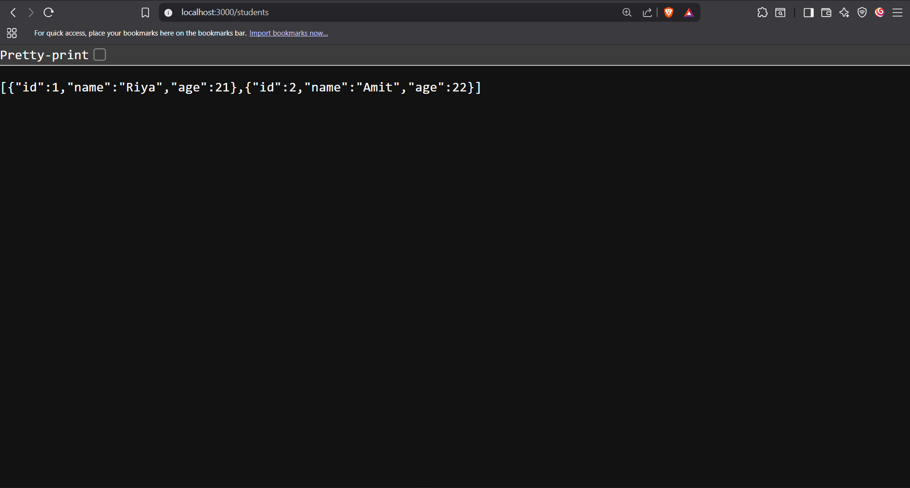

## 📘 README.md


# 🎓 Student CRUD API

A simple Node.js + Express API for managing students.
Supports full CRUD operations: Create, Read, Update, Delete.
Data is stored in a local students.json file.

---

## 🚀 Features
- Get all students
- Get a single student by ID
- Add a new student
- Update existing student
- Delete a student
- Data persistence with students.json

---

## 📂 Project Structure
```

student-crud-api/
│
├── server.js        # Express server with CRUD routes
└── students.json    # Local JSON database

````

---

## ⚡ Setup & Run

1. Clone the repo or create the folder:
   ```bash
   git clone <repo-url>
   cd student-crud-api
````

2. Install dependencies:

   ```bash
   npm install
   ```

3. Start the server:

   ```bash
   node server.js
   ```

   Server runs at [http://localhost:3000](http://localhost:3000)

---

## 📌 API Endpoints

### Get all students

```
GET /students
```

Response:

```json
{
  "success": true,
  "count": 2,
  "data": [
    { "id": 1, "name": "Riya", "age": 21 },
    { "id": 2, "name": "Amit", "age": 22 }
  ]
}
```

---

### Get a single student

```
GET /students/:id
```

---

### Add a new student

```
POST /students
Content-Type: application/json
```

Body:

```json
{
  "name": "Neha",
  "age": 20
}
```

---

### Update a student

```
PUT /students/:id
Content-Type: application/json
```

Body:

```json
{
  "name": "Riya Sharma",
  "age": 22
}
```

---

### Delete a student

```
DELETE /students/:id
```

---

## 🛠 Tech Stack

* Node.js
* Express.js
* JSON file storage (local)

---

## 📜 Notes

* Data is stored in students.json
* On every POST, PUT, DELETE, the file updates automatically
* This is a beginner-friendly project. For production, use a real database (for example MongoDB or PostgreSQL)

---

```
