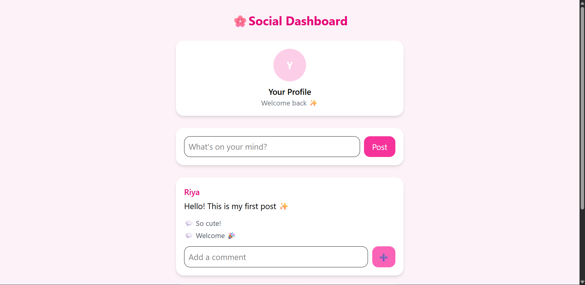

# Social Media Dashboard

A simple full-stack project with a React frontend and Node.js + Express backend.
Users can create posts, add comments, and view a profile section in a cute, minimal UI.

---

## 🚀 Features

* Post messages with your profile
* Add comments to posts
* Clean and minimal React UI
* Backend stores posts in a data.json file

---

## 📂 Project Structure

```
DAY-19/
│── backend/
│   ├── data.json        # JSON storage for posts and comments
│   └── server.js        # Express server
│
│── frontend/
│   └── frontend/
│       ├── public/      
│       ├── src/
│       │   ├── components/
│       │   │   ├── Postcards.jsx
│       │   │   └── Profilecard.jsx
│       │   ├── App.jsx
│       │   ├── main.jsx
│       │   ├── App.css
│       │   └── index.css
│       └── package.json
│
└── README.md
```

---

## ⚙️ Setup Instructions

### 1 Backend Setup

```
cd backend
npm init -y
npm install express cors
```

Run the backend:

```
node server.js
```

It will start at [http://localhost:5000](http://localhost:5000)

---

### 2 Frontend Setup

```
cd frontend/frontend
npm install
npm run dev
```

The React app will start (usually at [http://localhost:5173](http://localhost:5173) if using Vite)

---

## 🔗 API Endpoints

GET /posts → Get all posts

POST /posts → Add a new post

```
{
  "user": "Riya",
  "content": "Hello world!"
}
```

POST /posts/\:id/comments → Add a comment

```
{
  "comment": "Nice post!"
}
```

---

## 🎨 UI Preview

* Profile card with user info
* Postcards displaying posts and comments
* Input fields to add posts and comments

---

## 🛠 Tech Stack

* Frontend: React + Vite
* Backend: Node.js + Express
* Storage: JSON file (data.json)

---



