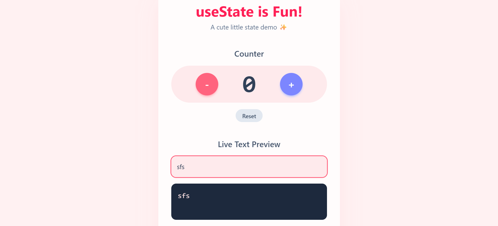

# ✨ Day-07: Cute React State Demo (React + Vite)

This project is a **Cute React State Demo** built with React (using Vite). It demonstrates **fundamental state management concepts** with a playful UI. The app includes a counter with animations and a live text previewer—perfect for beginners learning `useState`!

---

## 🛠️ Technologies Used

⚡ **Vite** – Fast React development environment
⚛️ **React** – Component-based UI library
🎨 **Tailwind CSS** – Utility-first styling framework
📦 **npm** – Dependency management

---

## ✨ Features

🔢 **Interactive Counter** – Increment, decrement, and reset with a fun "pop" animation on number changes.
⌨️ **Live Text Preview** – Type in an input box and see your text appear instantly below.
🎀 **Cute UI + Animations** – Soft pastel theme with smooth hover & button animations.
🛠️ **Custom Hook (useAnimation)** – Reusable hook to trigger animations when state updates.
📱 **Responsive Design** – Works beautifully across devices, from mobile to desktop.

---

## 🚀 Getting Started

1. **Clone the repository**

   ```bash
   git clone https://github.com/your-username/cute-react-state-demo.git
   cd cute-react-state-demo
   ```

2. **Install dependencies**

   ```bash
   npm install
   ```

3. **Run the development server**

   ```bash
   npm run dev
   ```

4. Open your browser and visit 👉 **[http://localhost:5173](http://localhost:5173)**

---

## 📁 File Structure

```
cute-react-state-demo/
├── public/
│   └── vite.svg           # Public assets
├── src/
│   ├── hooks/
│   │   └── useAnimation.js   # Custom hook for animations
│   ├── App.jsx             # Main app component
│   ├── index.css           # Tailwind + global styles
│   └── main.jsx            # Entry point
├── index.html              # Root HTML file
├── package.json            # Dependencies + scripts
└── README.md               # You are here!
```

---

