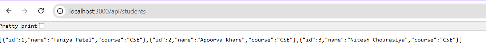

# 🚀 Day 05 – Express.js Basics

This project demonstrates the basics of **Express.js** by building a simple server that serves a static UI and provides a REST API for managing student data.

---

## ✨ Features
- Serves static frontend from the `public/` folder
- Provides a **REST API** to manage students
- `GET /api/students` → Returns list of students
- `POST /api/students` → Adds a new student
- Handles errors for duplicate IDs or missing fields
- SPA-friendly: always serves `index.html` for unknown routes

---

## 🛠️ Tech Stack
- **Backend:** Node.js, Express.js
- **Frontend:** HTML, CSS, JavaScript

---



## 🚦 Getting Started

### Steps: Install Dependencies and Run the Server
```bash
npm install
node server.js

By default, the server runs at:
👉 http://localhost:3000


